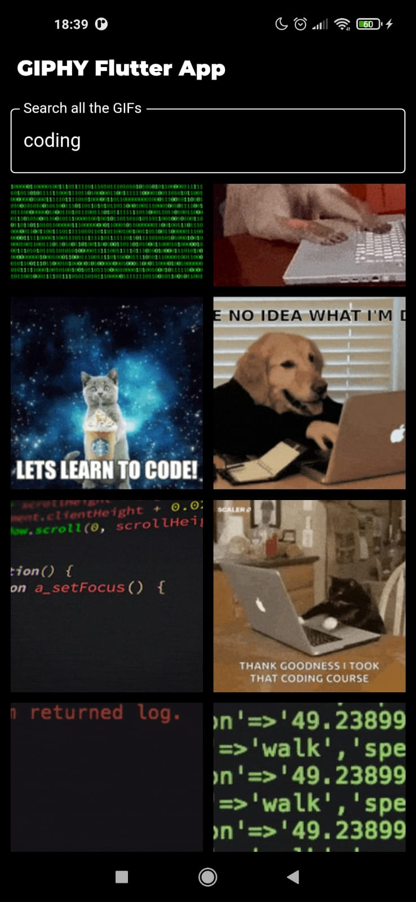
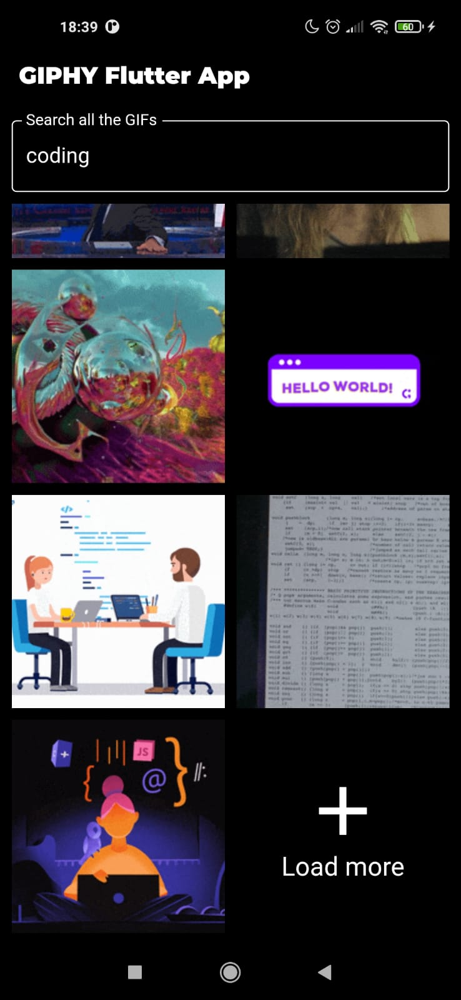

# ✌️ GIPHY Flutter App

Aplicação Mobile em Flutter - Buscador de GIFs utilizando GIPHY API.

## ⚙️ Informações adicionais

- Flutter: v. 2.5.1
- Dart: v. 2.14.2
- GIPHY API
- Fonte: Roboto Regular e Montserrat Black
- Share: v. 0.6+1
- HTTP: v. 0.12.0+2
- Transparent Image: v. 1.0.0

## ❗ Importante

Necessário incluir o trecho `--no-sound-null-safety` ao final do comando `flutter run`

## 🖼️ Imagens

  
  

  
  
